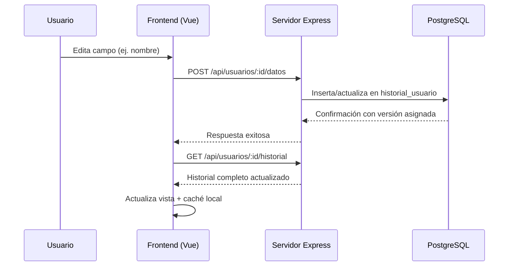
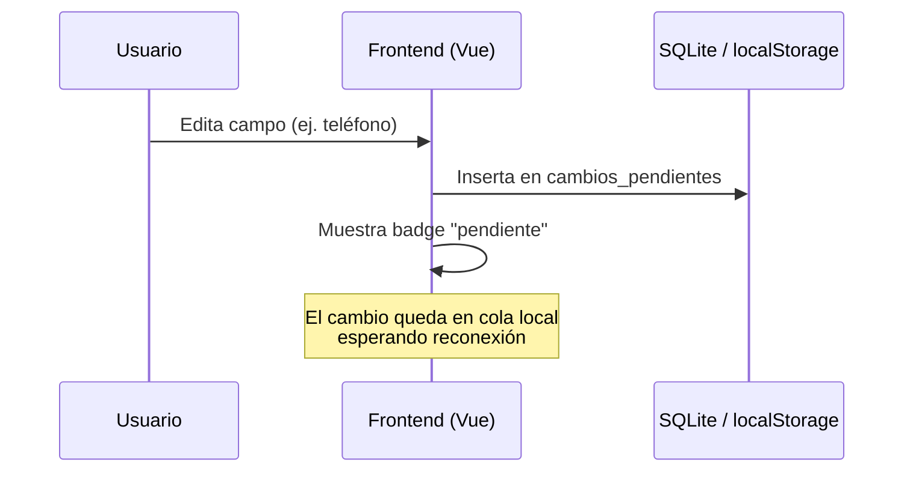
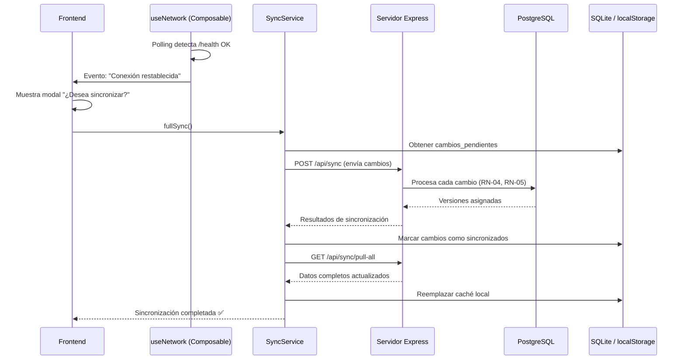

# Sincronización en Tiempo Real — Sistema GDO (Gestión de Datos Offline-Online)

Este documento describe en detalle cómo funciona el motor de sincronización bidireccional del sistema, el recorrido de mejoras implementadas para lograr una experiencia en tiempo real confiable, y los problemas que se encontraron durante el desarrollo junto con sus soluciones.

---

## 📐 Arquitectura General de Sincronización

El sistema GDO opera con una arquitectura de **doble almacenamiento** que permite al usuario trabajar con o sin conexión a internet de manera transparente:

```
┌─────────────────────────┐        ┌──────────────────────────┐
│   DISPOSITIVO LOCAL     │        │   SERVIDOR VPS           │
│                         │        │                          │
│  ┌───────────────────┐  │  PUSH  │  ┌────────────────────┐  │
│  │  SQLite (Android)  │──────────▶│  PostgreSQL (Docker)  │  │
│  │  localStorage (Web)│◀──────────│  (Fuente de verdad)  │  │
│  └───────────────────┘  │  PULL  │  └────────────────────┘  │
│                         │        │                          │
│  ┌───────────────────┐  │        │  ┌────────────────────┐  │
│  │ cambios_pendientes │  │        │  │ historial_usuario  │  │
│  │ (cola offline)     │  │        │  │ (registro oficial) │  │
│  └───────────────────┘  │        │  └────────────────────┘  │
└─────────────────────────┘        └──────────────────────────┘
```

### Principios Fundamentales
1. **PostgreSQL en el VPS es la fuente única de verdad.** Todas las versiones oficiales del historial se generan exclusivamente en el backend del servidor VPS.
2. **El almacenamiento local (SQLite/localStorage) es una caché de trabajo.** Su función es permitir al usuario operar sin internet y acumular cambios para sincronizarlos después.
3. **La sincronización es bidireccional:** el cliente sube (PUSH) sus cambios pendientes y luego descarga (PULL) los datos actualizados del servidor.

---

## 🔄 Flujo de Sincronización Paso a Paso

### Cuando el usuario está ONLINE y edita un campo:


### Cuando el usuario está OFFLINE y edita un campo:


### Cuando el usuario vuelve a estar ONLINE (reconexión):


---

## 🕐 Línea de Tiempo: Evolución del Sistema de Sincronización

### Fase 1 — Sincronización Base (Implementación Inicial)
> *Estado: El sistema podía guardar datos online y offline, pero la detección del estado de red era manual.*

- **Motor de sincronización (`sync.ts`):** Implementación del servicio `SyncService` con los métodos `fullSync()` y `pullFromServer()`.
- **Cola de cambios pendientes:** Tabla `cambios_pendientes` en SQLite/localStorage para almacenar modificaciones hechas sin internet.
- **Persistencia híbrida (`database.ts`):** Clase `DatabaseService` con detección automática de plataforma:
  - En Android (Capacitor nativo): usa `@capacitor-community/sqlite`.
  - En navegador web: usa `localStorage` como fallback transparente.

---

### Fase 2 — Detección de Red en Tiempo Real
> *Problema: El sistema solo detectaba el modo offline cuando el usuario ejecutaba una acción (por ejemplo, guardar un campo). No había detección proactiva.*

- **Composable `useNetwork.ts`:** Creación del composable reactivo que centraliza toda la lógica de detección de red.
- **Eventos del navegador:** Escucha de `window.addEventListener('online')` y `window.addEventListener('offline')` para detección instantánea en navegadores de escritorio.
- **Health Check del servidor:** Verificación activa de conectividad real mediante peticiones HTTP al endpoint `/api/health`, que valida no solo la conexión de red, sino también que el servidor Express y la base de datos PostgreSQL estén operativos.
- **Polling periódico (cada 4 segundos):** Rutina de sondeo continuo que verifica el estado de red sin depender únicamente de los eventos del navegador, asegurando la detección incluso cuando el navegador no emite los eventos correctamente.

---

### Fase 3 — Modal Interactivo de Reconexión
> *Mejora UX: Al recuperar la conexión, el usuario recibe un modal inmediato para sincronizar sus cambios pendientes.*

- **Detección de transición offline → online:** El composable `useNetwork` detecta cuando `connected` cambia de `false` a `true`.
- **Modal de sincronización (`MainLayout.vue`):** Al detectar la reconexión, si existen cambios pendientes, se muestra un diálogo preguntando al usuario si desea sincronizar ahora.
- **Notificaciones reactivas:** Banners y toasts que informan en tiempo real el estado actual:
  - 🟢 `"Conexión restablecida"` al volver online.
  - 🔴 `"Sin conexión — Trabajando en modo offline"` al perder la red.
  - ✅ `"Sincronización completada"` al finalizar el proceso.

---

### Fase 4 — Unificación del Historial (Fuente Única de Verdad)
> *Problema crítico: El historial online y offline mostraban datos diferentes. Cada origen tenía su propio historial separado, creando inconsistencias.*

- **Diagnóstico:** La caché local (SQLite/localStorage) mantenía un historial independiente del servidor. Cuando el usuario estaba online, veía el historial de PostgreSQL; cuando estaba offline, veía el historial local. Estos no coincidían.
- **Solución:** Al cargar datos estando online, el sistema ahora ejecuta `syncLocalHistoryWithServer()` que **reemplaza completamente el historial local con una copia fiel del historial del servidor.** De esta forma:
  - PostgreSQL es siempre la fuente de verdad.
  - SQLite/localStorage son espejos sincronizados que permiten consulta offline.
  - Al reconectarse, se descargan los datos completos mediante `pullFromServer()`.

---

### Fase 5 — Soporte Nativo Android (Capacitor + Emulador)
> *Objetivo: Hacer funcionar la sincronización en un emulador de Android a través de Android Studio.*

- **Resolución dinámica de API (`api.ts`):** Detección automática de la plataforma nativa para redirigir las peticiones API:
  - Navegador Web → `http://localhost:3005`
  - Emulador Android → `http://10.0.2.2:3005` (dirección especial de Android que mapea al localhost del host)
- **Servidor Express en `0.0.0.0`:** Configuración del servidor para escuchar en todas las interfaces de red, permitiendo que el emulador se conecte a través de la interfaz de red virtual.
- **Instalación de plugins nativos:** `@capacitor/network` para detección de red nativa y `@capacitor-community/sqlite` para persistencia SQLite nativa en Android.
- **Detección unificada en ambas plataformas:** El composable `useNetwork.ts` fue refactorizado para usar la misma lógica de verificación (`/health` + polling) tanto en web como en Android nativo.

---

### Fase 6 — Sincronización Multi-Dispositivo en Tiempo Real
> *Problema: Al hacer cambios desde el emulador Android y sincronizarlos, la versión web no detectaba los nuevos datos sin recargar manualmente la página.*

- **Polling de datos silencioso (`UserPage.vue`):** Se implementó un intervalo de refresco automático cada 10 segundos que, cuando el usuario está online, recarga silenciosamente los datos del servidor para detectar cambios hechos desde otros dispositivos.
- **Actualización reactiva del AuthStore:** Tras cada recarga de datos desde el servidor, se actualiza `authStore.user` con el nombre y apellido más recientes, asegurando que la tarjeta principal del encabezado siempre muestre la información vigente.

---

## 🐛 Registro de Problemas y Soluciones

### Problema 1: Fallo de conexión DNS a PostgreSQL
| Detalle | Descripción |
|---------|-------------|
| **Error** | `getaddrinfo ENOTFOUND dpg-xxx.virginia-postgres.render.com` |
| **Causa** | Los servidores de Render.com presentaban fallos DNS intermitentes al resolver la dirección del host de PostgreSQL. |
| **Solución** | Implementación de la función `connectWithRetry()` en `server/db.ts` con reintentos automáticos (3 intentos, 800ms de espera entre cada uno) para manejar los fallos DNS transitorios de manera transparente. |

---

### Problema 2: Detección offline no era en tiempo real
| Detalle | Descripción |
|---------|-------------|
| **Síntoma** | El banner de estado solo cambiaba a "OFFLINE" cuando el usuario realizaba una acción (guardar, navegar), no al momento de perder la conexión. |
| **Causa** | El sistema dependía únicamente de los errores de las peticiones API para detectar la desconexión. No existía un mecanismo proactivo de verificación. |
| **Solución** | Creación del composable `useNetwork.ts` con polling activo cada 4 segundos hacia el endpoint `/api/health`, combinado con listeners de eventos del navegador (`online`/`offline`). |

---

### Problema 3: Falsa re-autenticación al desconectarse
| Detalle | Descripción |
|---------|-------------|
| **Síntoma** | Al desconectar el Wi-Fi, aparecía brevemente el estado "OFFLINE" pero inmediatamente volvía a "ONLINE" a pesar de no tener internet. |
| **Causa** | El sistema re-verificaba la conexión demasiado rápido y los eventos del navegador disparaban una falsa reconexión antes de que la red se estabilizara. |
| **Solución** | Se priorizó la verificación real contra el endpoint `/health` del servidor por encima de los eventos del navegador. Si el health check falla, el sistema se mantiene firmemente en modo OFFLINE sin importar lo que reporte `navigator.onLine`. |

---

### Problema 4: Historiales separados entre online y offline
| Detalle | Descripción |
|---------|-------------|
| **Síntoma** | El historial del usuario mostraba datos diferentes dependiendo de si estaba online (datos de PostgreSQL) u offline (datos de SQLite/localStorage). |
| **Causa** | La caché local generaba su propio historial independiente sin sincronizarlo con la fuente de verdad del servidor. |
| **Solución** | Implementación de `syncLocalHistoryWithServer()` que reemplaza completamente el historial local con los datos oficiales del servidor cada vez que hay conexión. PostgreSQL es la única fuente que asigna versiones y mantiene la integridad del historial. |

---

### Problema 5: Error Mixed Content en emulador Android
| Detalle | Descripción |
|---------|-------------|
| **Error** | `Mixed Content: The page at 'https://localhost' was loaded over HTTPS, but requested an insecure XMLHttpRequest endpoint 'http://10.0.2.2:3005'` |
| **Causa** | Capacitor carga la WebView bajo `https://` por defecto (a partir de Capacitor 5+). Al hacer una petición HTTP plana al servidor local, el motor Chromium de Android la bloquea como contenido mixto. |
| **Solución** | Configuración de `"androidScheme": "http"` en `capacitor.config.json` para que la WebView se sirva bajo HTTP, eliminando el conflicto de contenido mixto. |

---

### Problema 6: Conexión rechazada desde el emulador (`ERR_CONNECTION_REFUSED`)
| Detalle | Descripción |
|---------|-------------|
| **Error** | `POST http://10.0.2.2:3005/api/auth/login net::ERR_CONNECTION_REFUSED` |
| **Causa** | El servidor Express escuchaba por defecto en `127.0.0.1` (solo conexiones locales). El emulador de Android llega a través de una interfaz de red virtual que no es `127.0.0.1`, por lo que la conexión era rechazada. |
| **Solución** | Modificación de `server/index.ts` para que el servidor escuche en `0.0.0.0` (todas las interfaces de red), permitiendo que tanto el navegador local como el emulador Android se conecten simultáneamente. |

---

### Problema 7: Plugins nativos no instalados en Android
| Detalle | Descripción |
|---------|-------------|
| **Error** | `"Network" plugin is not implemented on android` / `"CapacitorSQLite" plugin is not implemented on android` |
| **Causa** | Los paquetes `@capacitor/network` y `@capacitor-community/sqlite` estaban importados en el código TypeScript pero nunca fueron instalados como dependencias nativas dentro de la carpeta `src-capacitor/`. |
| **Consecuencia** | Sin el plugin de Network, la detección de red nativa lanzaba una excepción y la app se quedaba permanentemente en OFFLINE. Sin SQLite, el sistema activaba el fallback de localStorage (funcional, pero menos robusto). |
| **Solución** | Instalación de ambos plugins con `npm install @capacitor/network @capacitor-community/sqlite` dentro de `src-capacitor/`, seguido de `capacitor sync android` para registrarlos en el proyecto nativo. |

---

### Problema 8: Nombre desactualizado en la tarjeta principal (Web)
| Detalle | Descripción |
|---------|-------------|
| **Síntoma** | La tarjeta del encabezado en la web mostraba el nombre antiguo del usuario (fijado al momento del login), mientras que el campo editable mostraba el nombre actualizado correctamente. |
| **Causa** | `authStore.user.nombre` se establecía al hacer login y nunca se refrescaba cuando `loadUserData()` traía datos actualizados del servidor. |
| **Solución** | Añadir una llamada a `authStore.updateProfileFields()` dentro de `loadUserData()` cada vez que se cargan datos frescos del servidor, asegurando que la tarjeta siempre muestre la información vigente. |

---

### Problema 9: La web no detectaba cambios hechos desde otro dispositivo
| Detalle | Descripción |
|---------|-------------|
| **Síntoma** | Al hacer cambios offline desde el emulador Android y sincronizarlos con el servidor, la versión web no mostraba los datos actualizados ni el modal de sincronización. |
| **Causa** | La web no tenía ningún mecanismo para detectar que otro dispositivo había subido datos nuevos al servidor. Solo recargaba datos al pasar de offline a online o al guardar manualmente un campo. |
| **Solución** | Implementación de un polling silencioso cada 10 segundos en `UserPage.vue` que, si el usuario está online, recarga los datos del servidor automáticamente para reflejar cambios de otros dispositivos. |

---

## 📁 Archivos Clave del Sistema de Sincronización

| Archivo | Descripción |
|---------|-------------|
| `src/services/sync.ts` | Motor de sincronización: `fullSync()` (push + pull) y `pullFromServer()` |
| `src/services/database.ts` | Servicio de base de datos local con fallback SQLite ↔ localStorage |
| `src/services/api.ts` | Cliente HTTP Axios con resolución dinámica de URL por plataforma |
| `src/composables/useNetwork.ts` | Composable reactivo para detección de red en tiempo real |
| `src/stores/network.ts` | Store Pinia con estado reactivo de red (isOnline, isSyncing, pendingChanges) |
| `src/layouts/MainLayout.vue` | Layout principal con modal de reconexión y barra de estado |
| `src/pages/UserPage.vue` | Página de usuario con polling de datos multi-dispositivo |
| `server/db.ts` | Pool de conexiones PostgreSQL con reintentos automáticos |
| `server/routes/sync.ts` | Endpoints de sincronización del servidor |
| `server/routes/usuarios.ts` | Endpoints de gestión de usuarios y datos |
| `server/init-db.ts` | Script de inicialización del esquema PostgreSQL |
| `capacitor.config.json` | Configuración de Capacitor (esquema HTTP para Android) |
